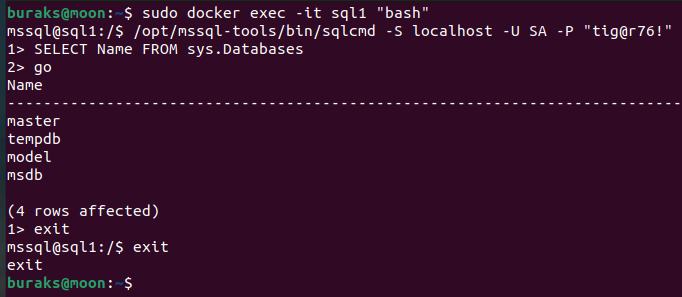
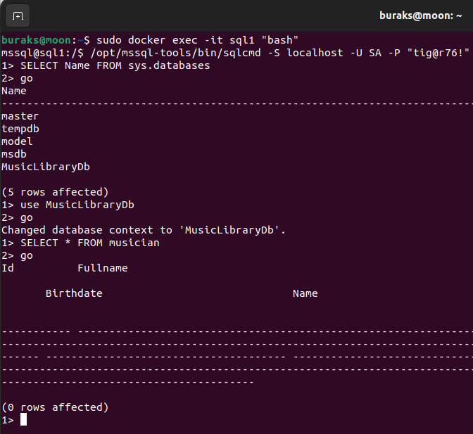

# Blazor ve gRPC

Bu örnekteki amacım Blazor uygulamalarında, gRPC servis kullanımını deneyimlemek. gRPC servisleri özellikle service-to-service iletişimde gecikme sürelerinin düşük, verimliliğin yüksek olması istenen hallerde sıklıkla tercih edilmekte. Protobuf protokolüne göre serileşen mesajların küçük boyutlu olması da cabası. gRPC ile ilgili belki de tek sıkıntı tarayıcı desteğinin olmaması. Karşı tarafta bir proto şemasının da bulunması gerekiyor. Bu noktada blazor ile iyi bir ikili olduklarını düşünebiliriz. Örnekte basit bir blazor uygulaması geliştirmeye çalışıp servis tabanlı iletişim için gRPC kullanmayı düşünüyorum. İzlediğim kitap hem REST hem de gRPC servislerini ele almış. Bunlar arasındaki geçişler için Source Generator kullanılıyor anladığım kadarı ile. Bakalım, bitirince anlayacağım.

Bu pratikte Amazon'dan bir heyecanla getirttiğim ancak Ubuntu ve Visual Studio Code odaklı anlatım yapmayıp, .Net 7 yerine de .Net 6.0 sürümünü kullandığından biraz da hayal kırıklığı yaşatan [**Building Blazor WebAssembly Applications with gRPC**](https://www.amazon.com.tr/Building-Blazor-WebAssembly-Applications-gRPC/dp/1804610550/ref=sr_1_1?__mk_tr_TR=%C3%85M%C3%85%C5%BD%C3%95%C3%91&crid=4X7VJ223EWP1&keywords=building+blazor+webassembly+applications+with+grpc&qid=1680897411&sprefix=building+blazor+webassembly+applications+with+grpc%2Caps%2C117&sr=8-1) isimli kitabı takip ediyorum. Eğer siz de bu kitabı tercih ederseniz kodları kopylamadan bakarak yazmaya ve anlamaya çalışın.


## Setup

Örneğin Ubuntu 22.04 sisteminde, SQL için docker imajı kullanarak geliştirmekteyim. Editor olarak Visual Studio Code kullanıyorum.

## Ön Hazırlıklar

Bu sefer gigabyte'larıma kıydım ve SQL Server 2022 docker imajı kurmaya karar verdim.

```bash
# SQL docker örneğini başlatmak için (Şifreyi siz istediğiniz gibi verebilir veya aynısını kullanabilirsiniz)
sudo docker run -e "ACCEPT_EULA=Y" -e "SA_PASSWORD=tig@r76!" -p 1433:1433 --name sql1 --hostname sql1 -d mcr.microsoft.com/mssql/server:2022-latest

# Container'ın çalıştığından emin olmak için
sudo docker ps -a

# terminalden docker içindeki sql komut satırına bağlanmak için
sudo docker exec -it sql1 "bash"
# ardından
/opt/mssql-tools/bin/sqlcmd -S localhost -U SA -P "tig@r76!"

# sistem veri tabanlarını görebiliyorsak işimiz tamamdır
SELECT Name FROM sys.Databases
GO
```



## EF Migration Tarafı

Entity Framework migration işlemleri için Microsoft.EntityFrameworkCore.Design paketinin projeye eklenmesi gerekiyor. Sonrasında örneğin Initial isimli migration planı aşağıdaki gibi oluşturulabilir.

```bash
# Entity tarafı ayrı bir kütüphaneye alındıktan sonra ise (MusicLibrary.Data)
# aşağıdaki şekilde ilerlenmelidir.
# Bu komutları MusicLibrary.Data klasörü içerisindeyken çalıştırabiliriz.
dotnet ef migrations add Intial --startup-project ../MusicLibrary.Service.Rest
dotnet ef database update --startup-project ..//MusicLibrary.Service.Rest
```

Eğer _database update_ işlemi başarılı bir şekilde çalıştıysa en azından komut satırından bile olsa veritabanımızı görmemiz lazım.



Pek tabi modelde değişiklikler yaparsak tekrardan bir migration planı oluşturup işletmemiz gerekiyor.

## Notlar

Grpc servislerine ait sözleşmeler MusicLibrary.Service.Grpc.Contract isimli projedeki proto dosylarından otomatik olaran üretilirler. proje dosyasındaki tanımlamalarda özellikle proto dosyaları için server veya client şeklinde roller belirlenmemiştir. Bunun sebebi hem Blazor Client tarafı hem de Service.Grpc tarafında bu kütüphanenin ortaklaşa kullanılmasıdır. Service.Grpc host time için gerekli grpc sözleşmelerini kullanırken, BlazorWASM Client tarafı da iletişim için gerekli proxy sözleşmelerini kullanabilir.